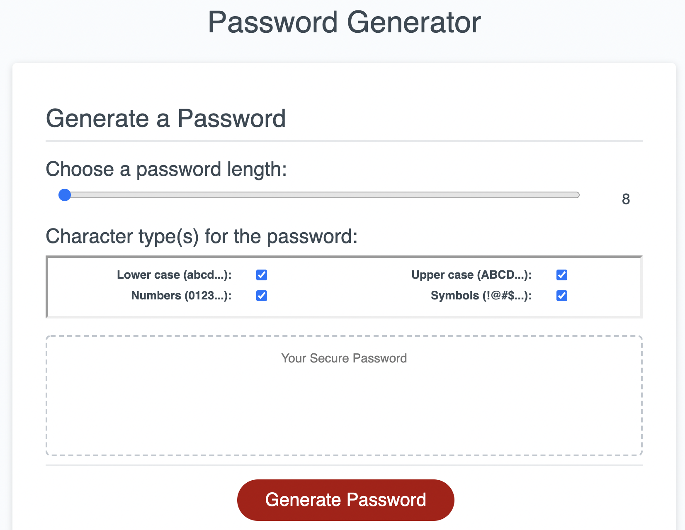

# 03 JavaScript: Password Generator

This is a simple HTML/CSS/Javascript interface(https://jsharples777.github.io/Week-03-Homework/) to generate a random
password that meets certain criteria (length 8 to 128, and character types - lower case, upper case, numbers, and/or symbols).

The user is presented with a slider element to set the password length, and a series of checkboxes to pick which character types they would like to use.

There is some basic validation that prevents the user from generating a password, with a visual warning explaining the problem (they haven't selected at least one of the character types).

## User Story

```
AS AN employee with access to sensitive data
I WANT to randomly generate a password that meets certain criteria
SO THAT I can create a strong password that provides greater security
```

## Mock-Up

The following image shows the web application's appearance and functionality:



## Technologies used
1. HTML 
2. CSS
3. Javascript
4. Bootstrap 3 library (http://getbootstrap.com)